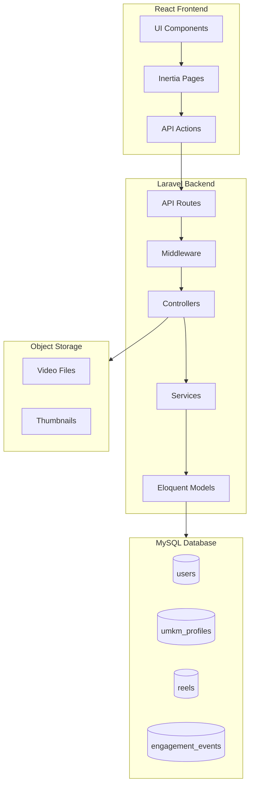

# Design Document: PKM Hyperlocal UMKM Platform Completion

## Overview

Dokumen ini menjelaskan desain teknis untuk menyelesaikan backend API dan integrasi frontend PKM Hyperlocal UMKM Platform. Platform ini menggunakan Laravel sebagai backend dengan Inertia.js + React sebagai frontend. Fokus utama adalah implementasi API untuk manajemen profil UMKM, reels content, location-based feed, engagement tracking, dan admin panel.

## Architecture



## Components and Interfaces

### Database Schema

#### umkm_profiles Table
```sql
CREATE TABLE umkm_profiles (
    id BIGINT UNSIGNED PRIMARY KEY AUTO_INCREMENT,
    user_id BIGINT UNSIGNED NOT NULL UNIQUE,
    nama_toko VARCHAR(255) NOT NULL,
    nomor_wa VARCHAR(20) NOT NULL,
    alamat TEXT NOT NULL,
    latitude DECIMAL(10, 8) NOT NULL,
    longitude DECIMAL(11, 8) NOT NULL,
    kategori VARCHAR(50) NOT NULL,
    deskripsi TEXT NULL,
    avatar VARCHAR(255) NULL,
    is_open BOOLEAN DEFAULT TRUE,
    open_hours VARCHAR(50) NULL,
    is_blocked BOOLEAN DEFAULT FALSE,
    created_at TIMESTAMP,
    updated_at TIMESTAMP,
    FOREIGN KEY (user_id) REFERENCES users(id) ON DELETE CASCADE
);
```

#### reels Table
```sql
CREATE TABLE reels (
    id BIGINT UNSIGNED PRIMARY KEY AUTO_INCREMENT,
    umkm_profile_id BIGINT UNSIGNED NOT NULL,
    video_url VARCHAR(500) NULL,
    thumbnail_url VARCHAR(500) NULL,
    product_name VARCHAR(255) NOT NULL,
    caption TEXT NULL,
    price DECIMAL(12, 2) NULL,
    kategori VARCHAR(50) NOT NULL,
    type ENUM('video', 'image') DEFAULT 'video',
    status ENUM('draft', 'review', 'published') DEFAULT 'draft',
    created_at TIMESTAMP,
    updated_at TIMESTAMP,
    FOREIGN KEY (umkm_profile_id) REFERENCES umkm_profiles(id) ON DELETE CASCADE
);
```

#### engagement_events Table
```sql
CREATE TABLE engagement_events (
    id BIGINT UNSIGNED PRIMARY KEY AUTO_INCREMENT,
    reel_id BIGINT UNSIGNED NOT NULL,
    user_identifier VARCHAR(255) NULL,
    event_type ENUM('view', 'like', 'share', 'click_wa') NOT NULL,
    created_at TIMESTAMP,
    FOREIGN KEY (reel_id) REFERENCES reels(id) ON DELETE CASCADE,
    INDEX idx_reel_event (reel_id, event_type),
    INDEX idx_user_reel_event (user_identifier, reel_id, event_type, created_at)
);
```

### API Endpoints

#### UMKM Profile Endpoints
```
POST   /api/seller/profile     - Create UMKM profile
PUT    /api/seller/profile     - Update UMKM profile
GET    /api/seller/profile     - Get own profile
GET    /api/umkm/{id}          - Get public UMKM profile
```

#### Reels Endpoints
```
GET    /api/reels              - Get feed (public, location-based)
GET    /api/reels/{id}         - Get single reel (public)
POST   /api/seller/reels       - Create reel
PUT    /api/seller/reels/{id}  - Update reel
DELETE /api/seller/reels/{id}  - Delete reel
GET    /api/seller/reels       - Get own reels
```

#### Engagement Endpoints
```
POST   /api/reels/{id}/events  - Record engagement event
GET    /api/seller/stats       - Get seller statistics
```

#### Admin Endpoints
```
GET    /api/admin/sellers      - List all sellers
POST   /api/admin/sellers/{id}/block   - Block seller
POST   /api/admin/sellers/{id}/unblock - Unblock seller
GET    /api/admin/stats        - Platform statistics
```

#### Upload Endpoints
```
POST   /api/seller/uploads/video/init  - Get pre-signed upload URL
POST   /api/seller/uploads/complete    - Complete upload
```

### Controller Interfaces

```php
interface UmkmProfileControllerInterface {
    public function store(StoreProfileRequest $request): JsonResponse;
    public function update(UpdateProfileRequest $request): JsonResponse;
    public function show(): JsonResponse;
    public function showPublic(int $id): JsonResponse;
}

interface ReelsControllerInterface {
    public function index(FeedRequest $request): JsonResponse;
    public function show(int $id): JsonResponse;
    public function store(StoreReelRequest $request): JsonResponse;
    public function update(UpdateReelRequest $request, int $id): JsonResponse;
    public function destroy(int $id): JsonResponse;
    public function sellerReels(Request $request): JsonResponse;
}

interface EngagementControllerInterface {
    public function recordEvent(RecordEventRequest $request, int $reelId): JsonResponse;
    public function sellerStats(): JsonResponse;
}

interface AdminControllerInterface {
    public function sellers(Request $request): JsonResponse;
    public function blockSeller(int $id): JsonResponse;
    public function unblockSeller(int $id): JsonResponse;
    public function stats(): JsonResponse;
}
```

### Service Layer

```php
interface LocationServiceInterface {
    public function calculateDistance(float $lat1, float $lng1, float $lat2, float $lng2): float;
    public function getReelsWithinRadius(float $lat, float $lng, float $radius): Collection;
}

interface WhatsAppServiceInterface {
    public function generateLink(string $phone, string $productName, string $umkmName): string;
}

interface EngagementServiceInterface {
    public function recordEvent(int $reelId, string $eventType, ?string $userIdentifier): bool;
    public function shouldThrottle(int $reelId, string $eventType, string $userIdentifier): bool;
    public function getStats(int $umkmProfileId): array;
}
```

## Data Models

### UmkmProfile Model
```php
class UmkmProfile extends Model {
    protected $fillable = [
        'user_id', 'nama_toko', 'nomor_wa', 'alamat',
        'latitude', 'longitude', 'kategori', 'deskripsi',
        'avatar', 'is_open', 'open_hours', 'is_blocked'
    ];
    
    protected $casts = [
        'latitude' => 'decimal:8',
        'longitude' => 'decimal:8',
        'is_open' => 'boolean',
        'is_blocked' => 'boolean',
    ];
    
    public function user(): BelongsTo;
    public function reels(): HasMany;
}
```

### Reel Model
```php
class Reel extends Model {
    protected $fillable = [
        'umkm_profile_id', 'video_url', 'thumbnail_url',
        'product_name', 'caption', 'price', 'kategori',
        'type', 'status'
    ];
    
    protected $casts = [
        'price' => 'decimal:2',
    ];
    
    public function umkmProfile(): BelongsTo;
    public function engagementEvents(): HasMany;
    public function getWhatsappLinkAttribute(): string;
}
```

### EngagementEvent Model
```php
class EngagementEvent extends Model {
    protected $fillable = [
        'reel_id', 'user_identifier', 'event_type'
    ];
    
    public const TYPE_VIEW = 'view';
    public const TYPE_LIKE = 'like';
    public const TYPE_SHARE = 'share';
    public const TYPE_CLICK_WA = 'click_wa';
    
    public function reel(): BelongsTo;
}
```

## Correctness Properties

*A property is a characteristic or behavior that should hold true across all valid executions of a system-essentially, a formal statement about what the system should do. Properties serve as the bridge between human-readable specifications and machine-verifiable correctness guarantees.*

### Property 1: Profile CRUD Consistency
*For any* valid UMKM profile data, creating a profile then reading it should return equivalent data with all submitted fields preserved.
**Validates: Requirements 1.1, 1.3, 1.4**

### Property 2: Profile Validation Rejects Invalid Data
*For any* WhatsApp number not matching Indonesian format (08xx or 628xx) or coordinates outside valid range (-90 to 90 lat, -180 to 180 lng), the system should reject the submission with validation error.
**Validates: Requirements 1.5, 1.6**

### Property 3: Reel CRUD Consistency
*For any* valid reel data, creating, updating, or deleting a reel should result in consistent state where reads reflect the latest operation.
**Validates: Requirements 2.1, 2.2, 2.3, 2.4**

### Property 4: YouTube URL Validation
*For any* URL that is not a valid YouTube URL format (youtube.com/watch, youtu.be, youtube.com/shorts), the system should reject the reel creation.
**Validates: Requirements 2.5**

### Property 5: Location-Based Feed Filtering
*For any* feed request with latitude, longitude, and radius, all returned reels should be from UMKM profiles within the specified radius distance.
**Validates: Requirements 3.1**

### Property 6: Feed Sorting Consistency
*For any* feed result, reels should be sorted by distance (ascending) as primary sort and creation time (descending) as secondary sort.
**Validates: Requirements 3.2**

### Property 7: WhatsApp Link Generation
*For any* reel with associated UMKM profile, the generated WhatsApp link should contain the product name and UMKM name in the message template.
**Validates: Requirements 4.1, 4.2**

### Property 8: Engagement Event Recording
*For any* engagement action (view, like, share, click_wa), the system should record an event that can be retrieved in statistics.
**Validates: Requirements 5.1, 5.2, 5.3, 5.4**

### Property 9: Engagement Throttling
*For any* duplicate engagement event from the same user identifier within 1 minute, the system should not create a new event record.
**Validates: Requirements 5.5**

### Property 10: Statistics Aggregation Accuracy
*For any* seller, the statistics should accurately reflect the count of each engagement event type across all their reels.
**Validates: Requirements 5.6**

### Property 11: Seller Blocking Round-Trip
*For any* seller, blocking then unblocking should restore their content visibility to the original state.
**Validates: Requirements 6.2, 6.3**

### Property 12: Admin Authorization
*For any* request to admin endpoints from a non-admin user, the system should return 403 Forbidden.
**Validates: Requirements 6.5**

### Property 13: JSON Serialization Round-Trip
*For any* valid data model (UmkmProfile, Reel, EngagementEvent), serializing to JSON then deserializing should produce an equivalent object.
**Validates: Requirements 8.4, 8.5**

## Error Handling

### Validation Errors (422)
```json
{
    "message": "The given data was invalid.",
    "errors": {
        "field_name": ["Error message"]
    }
}
```

### Authentication Errors (401)
```json
{
    "message": "Unauthenticated."
}
```

### Authorization Errors (403)
```json
{
    "message": "Forbidden"
}
```

### Not Found Errors (404)
```json
{
    "message": "Resource not found."
}
```

### Rate Limiting (429)
```json
{
    "message": "Too Many Attempts.",
    "retry_after": 60
}
```

## Testing Strategy

### Unit Tests
- Model validation rules
- Service layer business logic
- WhatsApp link generation
- Distance calculation
- Engagement throttling logic

### Property-Based Tests
Using PHPUnit with custom generators:
- Profile CRUD consistency (Property 1)
- Validation rejection (Property 2)
- Reel CRUD consistency (Property 3)
- Location filtering (Property 5)
- Feed sorting (Property 6)
- WhatsApp link content (Property 7)
- Engagement recording (Property 8)
- Throttling behavior (Property 9)
- Statistics accuracy (Property 10)
- Blocking round-trip (Property 11)
- Authorization (Property 12)
- JSON round-trip (Property 13)

### Integration Tests
- Full API endpoint testing
- Database transaction handling
- File upload flow
- Authentication flow

### Test Configuration
- Minimum 100 iterations per property test
- Use SQLite in-memory for fast testing
- Mock external services (storage, etc.)
